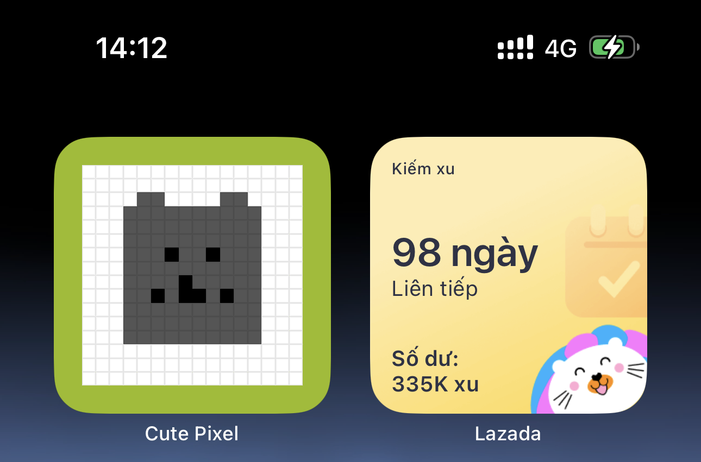
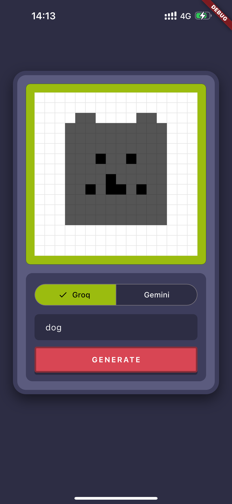

# 🎨 Cute Pixel

AI-powered pixel art generator built with Flutter. Transform text prompts into retro-style 16x16 pixel art using Groq or Gemini AI models.




## Features

- 🤖 **Dual AI Support** - Choose between Groq (Llama 3.3) or Gemini 2.0 Flash
- 🎮 **Retro UI** - Game Boy-inspired interface with pixel-perfect design
- ⚡ **Real-time Generation** - Fast pixel art creation from simple text prompts
- 📱 **Cross-platform** - Runs on iOS, Android, Web, and Desktop

## Setup

1. Clone the repository
2. Create a `.env` file in the root directory:

```env
GROQ_API_KEY=your_groq_api_key
GEMINI_API_KEY=your_gemini_api_key
```

3. Install dependencies:

```bash
flutter pub get
```

4. Run the app:

```bash
flutter run
```

## Usage

1. Select your preferred AI model (Groq or Gemini)
2. Enter a prompt (e.g., "cat", "heart", "tree")
3. Press GENERATE or hit Enter
4. Watch your pixel art come to life!

## Tech Stack

- **Flutter** - Cross-platform UI framework
- **Groq API** - Fast LLM inference with Llama 3.3
- **Gemini API** - Google's generative AI model
- **flutter_dotenv** - Environment variable management
